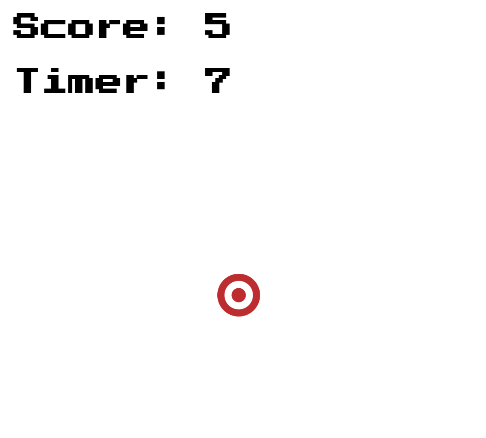

[](https://app.netlify.com/sites/neilsaim/deploys)

## Aim game

- [General info](#general-info)
- [Technologies](#technologies)
- [Setup](#setup)

## General info

This repository holds the source code for a web game. The objective is to shoot the target as many times as you can before time runs out!

## Technologies

Project is created with:

- React: 17.0.2

## Setup

To run this project, install it locally using npm:

```
$ cd ./aim-react
$ npm install
$ npm start
```

## Demo

The live demo is deployed on Netlify: https://neilsaim.netlify.com/


